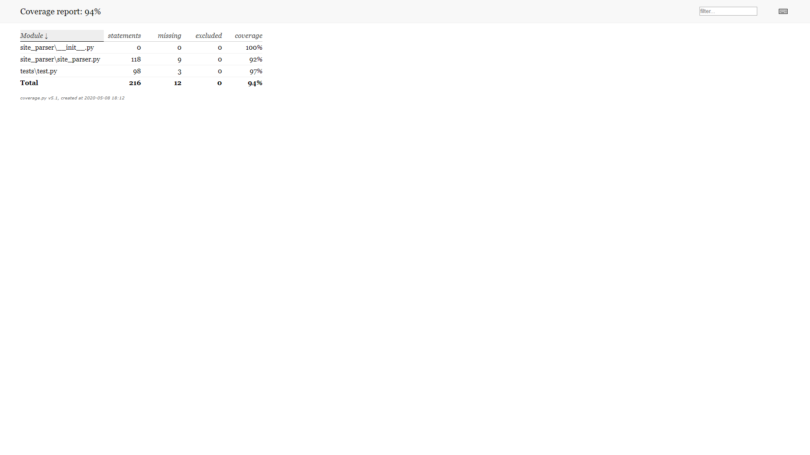

# Comp-Architecture-Lab1
Лабораторна робота виконана Єрмоленком Денисом з КВ-73. <br/>
Варіант 5 <br/>
"ПЗ для створення плейлистів. Реалізувати проходження по сторінкам з набору url, які задані у вхідному xml-файлі, а також по сторінкам, на які є посилання з цих сторінок з заданою глибиною вкладеності. На всіх цих сторінках знайти всі посилання на mp3-файли, знайдені файли відфільтрувати за заданим жанром, який зберігається у ID3-запису, та результат зберігти у файл в форматі xml.
" <br/><br/>

для запуску ПЗ треба використовувати scrape_mp3_from_sites з site_parser/site_parser.py

Приклад виклику ПЗ:
```
from site_parser import site_parser
site_parser.scrape_mp3_from_sites("data.xml",1)
```
де "data.xml" - вхідний файл з сайтами для сканування  
а 1 - рівень заглиблення (не рекомендується більше 2)

Приклад вхідного xml файлу
```
<?xml version="1.0"?>
<data>
    <site>https://mp3-music.club/hity-2017/</site>
    <site>https://drivemusic.me/pop_music/35672-a-ha-lifelines.html</site>
</data>
```

Приклад вихідного xml файлу
```
<?xml version="1.0" ?>
<Playlist>
	<Genre name="genre1">
		<music>
			<filename>music1.mp3</filename>
			<title>Music titel</title>
			<link>https://www.somesite.com/mp3/music1.mp3</link>
		</music>
		<music>
			<filename>music2.mp3</filename>
			<title>Music title2</title>
			<link>https://www.somesite.com/mp3/music2.mp3</link>
		</music>
  </Genre>
</Playlist>
```

результат coverage


Використання gevent налаштовується в setting.cfg  

Результати тестувань швидкості роботи (отриманні через timeit.timeit)
1) Без gevent 440 сек
2) З gevent 230 сек  
Хоча ці дані не дуже точні, бо є вплив роботи Інтернету та операційної системи на результати, але все рівно видно, що з gevent є пришвидшення роботи, яке досягається при завантаженні парарельно багатьох mp3 файлів
